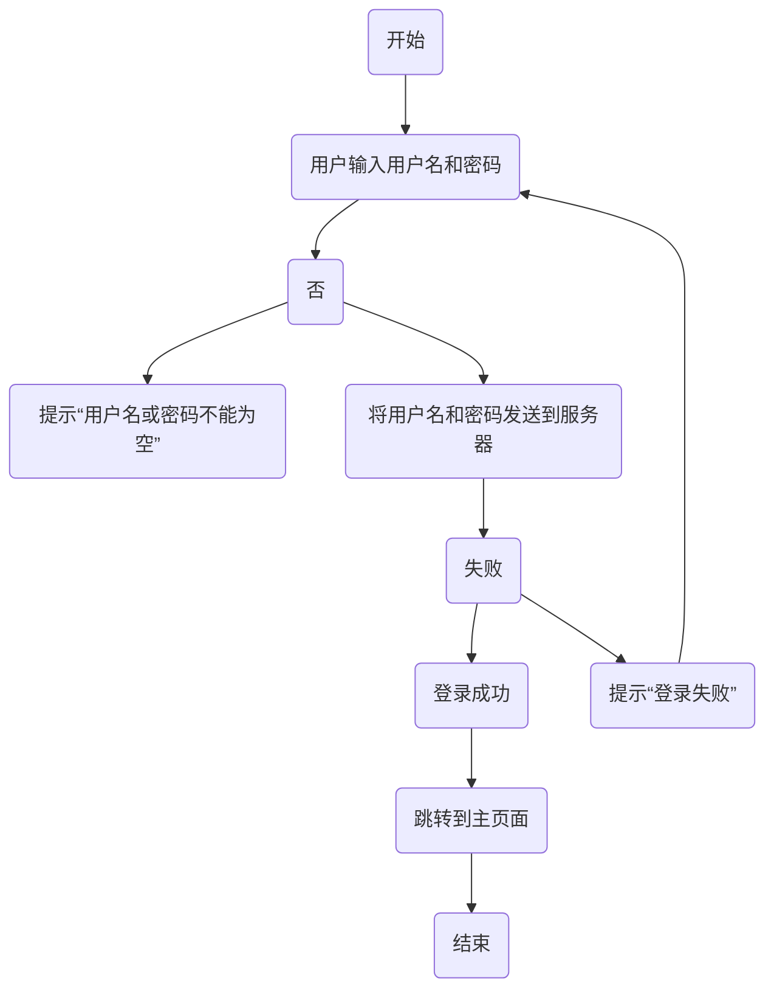

```mermaid
graph TD
A(开始) --> B(用户输入用户名和密码)
B --> C(判断用户名和密码是否为空)
C(是) --> D(提示“用户名或密码不能为空”)
C(否) --> E(将用户名和密码发送到服务器)
E --> F(服务器验证用户名和密码)
F(成功) --> G(登录成功)
F(失败) --> H(提示“登录失败”)
G --> I(跳转到主页面)
H --> B
I --> J(结束)

```